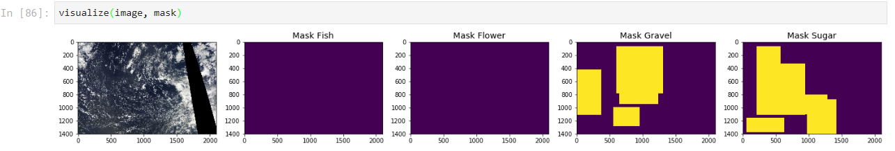

# Day1

- Headstart, setup folder structure/sample data for fast exploration

# Day 2
* A few key points, cloud distribution varies on geolocation, maybe useful to identify the geolocation by recognizing the black mark(satellite shadow as a feature)

# Todo
- [ ] Figure out what transformation make sense for satellite image
- [ ] Cluster base on Dark Shadow
- [ ]  ItemList
- [ ]  ImageSegment
- [ ]  SmoothLoss
- [ ]  What type is y on camvid?